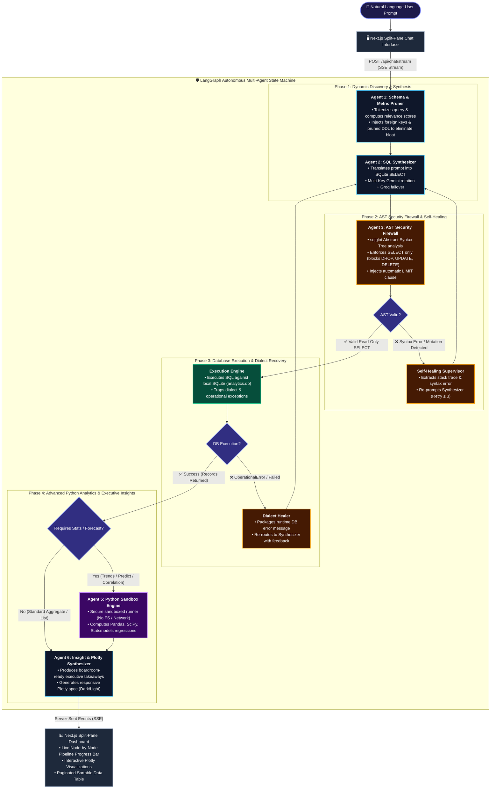

# QueryGuard AI 🛡️ — Autonomous Multi-Agent BI Copilot with AST Security & Self-Healing SQL

> **Enterprise-grade, local-first agentic decision intelligence engine.** Translates natural language questions into safe SQL, executes with deterministic AST-level guardrails, recovers autonomously from errors, executes sandboxed Python data science models, and streams live visual analytics.

---

## ⚡ Key Highlights for Judges & Architects

- **🛡️ Deterministic AST-Level Security Firewall (`sqlglot`):** Unlike naive prompt-only guardrails, QueryGuard parses Abstract Syntax Trees to guarantee 100% read-only safety. Blocks destructive mutations (`DROP`, `DELETE`, `UPDATE`, `ALTER`, `TRUNCATE`, `REPLACE`, `MERGE`), detects dangerous nested subqueries, and injects protective row limits.
- **🔄 Closed-Loop Autonomous Self-Healing:** Powered by a cyclic LangGraph state machine. When AST validation catches syntax ambiguities or SQLite raises runtime dialect errors, the agent diagnoses the stack trace and autonomously repairs the query (up to 3 iterations) without human intervention.
- **📊 Sandboxed Python Statistical Engine:** When queries demand predictive analytics, forecasting, or correlation, the pipeline dynamically launches a secure sandboxed execution environment with Pandas, NumPy, SciPy, and Statsmodels.
- **📈 Interactive Plotly Dashboards & Executive Insights:** Generates boardroom-ready executive summaries alongside responsive Plotly charts (dark/light theme) and paginated data tables.
- **⚡ Real-Time Multi-Agent Live Trace:** FastAPI Server-Sent Events (SSE) stream the real-time status of each agent node (`retrieve_schema` → `generate_sql` → `validate_sql` → `execute_sql` → `advanced_analysis` → `synthesize_insights`) directly to the Next.js UI.
- **🔑 Resilient Multi-Key Failover:** Load-balances across Gemini API keys with instant fallback to Groq (`llama-3.3-70b-versatile`) on rate limits or quotas.

---

## 🏛️ Multi-Agent System Architecture



### 🧩 Collaborative Agent Network

| Agent Node | Core Responsibility | Security & Reliability Guarantee |
|:---|:---|:---|
| **`retrieve_schema_node`** | Fuzzy-tokenizes query; extracts top relevant tables & DDL foreign keys. | Prevents prompt bloat and eliminates schema hallucination. |
| **`generate_sql_node`** | Translates natural language into SQLite dialect SQL with alias precision. | Resilient multi-key round-robin rotation + Groq 70B failover. |
| **`validate_sql_node`** | Parses query AST (`sqlglot`); blocks any mutation statement or subquery. | **Deterministic Zero-Trust:** Mathematical guarantee against `DROP`, `DELETE`, `UPDATE`. |
| **`execute_sql_node`** | Executes validated queries against `analytics.db` and packages results. | Dialect error trapping; routes runtime failures back to self-healing loop. |
| **`advanced_analysis_node`** | Automatically detects statistical questions (correlations, predictions, regressions). | **Sandboxed Python execution:** Pandas, SciPy, Statsmodels with zero network/disk access. |
| **`synthesize_insights_node`** | Builds executive plain-English findings + JSON Plotly visualization spec. | Boardroom-ready takeaways with dynamic chart layout matching dark/light themes. |

---

## Tech Stack

| Layer | Technology |
|---|---|
| **Agent Orchestration** | LangGraph, LangChain Core |
| **LLMs & Failover** | Google Gemini (Multi-Key Rotation), Groq (Llama 3.3 70B), OpenAI, Anthropic |
| **SQL Safety & AST Parser** | `sqlglot` Abstract Syntax Tree inspection |
| **API Server** | FastAPI + Uvicorn (SSE event streaming) |
| **Database** | SQLite (`analytics.db`) with relational FK topologies |
| **Data Science Sandbox** | Pandas, NumPy, SciPy, Statsmodels |
| **Frontend** | Next.js 14 (App Router), TypeScript, Tailwind CSS, Plotly.js, Lucide Icons |

---

## Quick Start

### Prerequisites
- Python 3.11+
- Node.js 18+
- An OpenAI **or** Anthropic API key

### 1 — Clone & configure

```bash
cp .env.example backend/.env
# Edit backend/.env and set your API key + LLM_PROVIDER
```

### 2 — Backend (Terminal 1)

```bash
cd backend

# Create and activate virtual environment
python -m venv .venv

# Windows
.venv\Scripts\activate
# macOS/Linux
source .venv/bin/activate

# Install dependencies
pip install -r requirements.txt

# Seed the database (runs automatically on first start, but can be run manually)
python -m app.db.seed_mock_data

# Start the API server
python run.py
```

The API will be available at **http://localhost:8000**
Interactive API docs at **http://localhost:8000/docs**

### 3 — Frontend (Terminal 2)

```bash
cd frontend

npm install

npm run dev
```

The UI will be available at **http://localhost:3000**

---

## Example Queries

- *"Show me monthly revenue trends for the last 12 months"*
- *"Which customer segments have the highest churn rate?"*
- *"Compare average order value across product categories"*
- *"Run a correlation analysis between support ticket volume and subscription cancellations"*
- *"Forecast next quarter's revenue using the last 2 years of data"*

---

## Agent Nodes

| Node | Responsibility |
|------|---------------|
| `retrieve_schema_node` | Fuzzy-matches relevant tables/columns from user query |
| `generate_sql_node` | LLM translates English → SQLite SQL; accepts error feedback |
| `validate_sql_node` | AST-validates, blocks writes, enforces LIMIT |
| `execute_sql_node` | Runs SQL, routes errors back for self-healing |
| `advanced_analysis_node` | Detects if stats/forecasting needed; runs sandboxed Python |
| `synthesize_insights_node` | Builds executive summary + Plotly chart spec |

---

## Project Structure

```
├── .env.example
├── README.md
├── backend/
│   ├── requirements.txt
│   ├── run.py
│   ├── main.py
│   └── app/
│       ├── config.py
│       ├── state.py
│       ├── graph.py
│       ├── nodes/
│       │   ├── schema_retriever.py
│       │   ├── sql_generator.py
│       │   ├── sql_validator.py
│       │   ├── db_executor.py
│       │   ├── advanced_analyzer.py
│       │   └── insight_synthesizer.py
│       ├── db/
│       │   ├── connection.py
│       │   └── seed_mock_data.py
│       └── sandbox/
│           └── runner.py
└── frontend/
    ├── package.json
    ├── tailwind.config.js
    ├── next.config.mjs
    ├── app/
    │   ├── layout.tsx
    │   ├── page.tsx
    │   └── globals.css
    └── components/
        ├── ChatSidebar.tsx
        ├── TraceViewer.tsx
        ├── ChartRenderer.tsx
        └── DataTable.tsx
```
